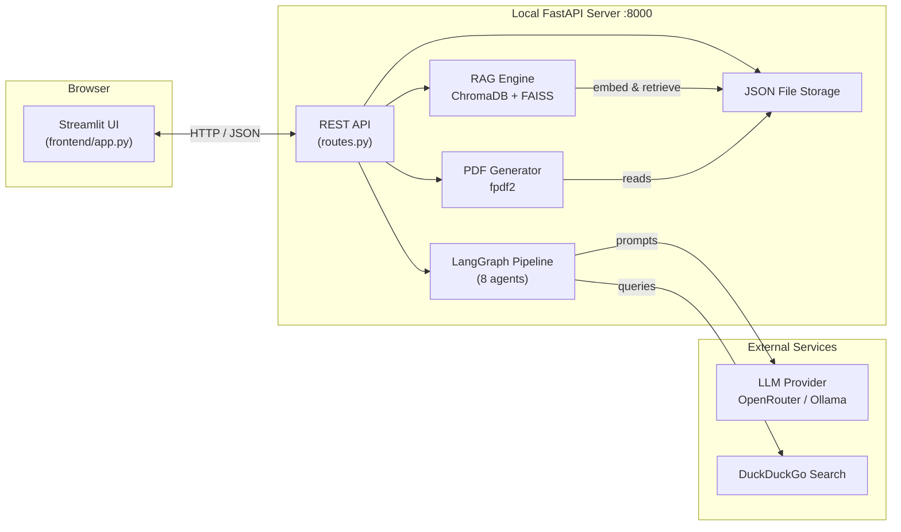
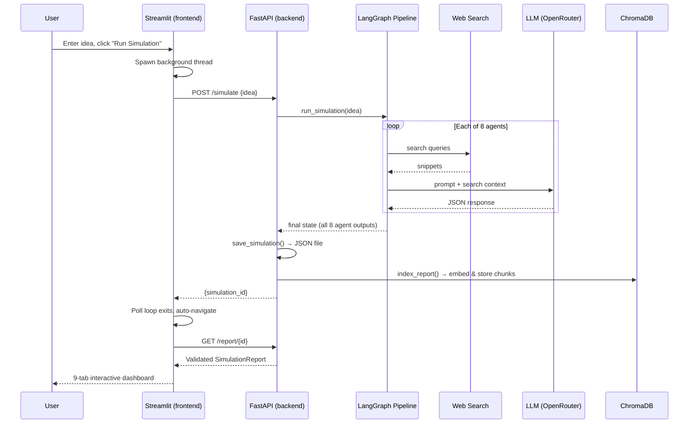

<div align="center">

```
 ██████╗██████╗ ██╗   ██╗ ██████╗██╗██████╗ ██╗     ███████╗
██╔════╝██╔══██╗██║   ██║██╔════╝██║██╔══██╗██║     ██╔════╝
██║     ██████╔╝██║   ██║██║     ██║██████╔╝██║     █████╗
██║     ██╔══██╗██║   ██║██║     ██║██╔══██╗██║     ██╔══╝
╚██████╗██║  ██║╚██████╔╝╚██████╗██║██████╔╝███████╗███████╗
 ╚═════╝╚═╝  ╚═╝ ╚═════╝  ╚═════╝╚═╝╚═════╝ ╚══════╝╚══════╝
```

### Where startup ideas are tested under fire.

**An 8-agent AI research pipeline that interrogates your startup idea like a room full of skeptical experts — then writes the report.**

[](https://www.python.org)
[](https://fastapi.tiangolo.com)
[](https://streamlit.io)
[](https://langchain-ai.github.io/langgraph/)
[](LICENSE)
[]()

[Quick Start](#-quick-start) •
[Architecture](#-architecture) •
[The Eight Agents](#-the-eight-agents) •
[API Reference](#-api-reference) •
[Screenshots](#-screenshots)

</div>

---

## What is Crucible?

Crucible is a **locally-run, multi-agent AI system** that takes a single sentence describing a startup idea and puts it through the same gauntlet a real founder faces before raising a seed round: market sizing, competitive mapping, customer validation, investor scrutiny, failure-mode analysis, and (for Indian founders) a full breakdown of government schemes, tax benefits, and DPIIT eligibility.

Unlike a single ChatGPT prompt, Crucible runs **eight specialized AI agents**, each with a distinct expert persona, each performing **live web search** before writing its section — then a final Judge agent synthesizes everything into a 0–100 viability score, a Proceed/Pivot/Abandon verdict, and a concrete 90-day execution plan.

Everything runs on your machine. Your idea never leaves your laptop except to query a search engine and an LLM API of your choice.

```
 You type:  "An AI tool for Indian kirana stores that tracks
             inventory from a WhatsApp photo and auto-orders
             from distributors."

 Crucible returns:  A 10-section report with real competitor
             names and funding, real Indian VCs, real failed
             startups in this space, a 90-day plan, and a
             downloadable PDF — in under 5 minutes.
```

---

## Table of Contents

- [Why Crucible](#why-crucible)
- [Key Features](#-key-features)
- [Architecture](#-architecture)
- [The Eight Agents](#-the-eight-agents)
- [Tech Stack](#-tech-stack)
- [Quick Start](#-quick-start)
- [Configuration](#-configuration)
- [Project Structure](#-project-structure)
- [API Reference](#-api-reference)
- [The Report](#-the-report)
- [Data & Storage](#-data--storage)
- [Screenshots](#-screenshots)
- [Troubleshooting](#-troubleshooting)
- [Roadmap](#-roadmap)
- [Contributing](#-contributing)
- [License](#-license)

---

## Why Crucible

Most "AI startup idea validators" are a single prompt wrapped in a UI. They hallucinate market sizes, invent competitors that don't exist, and give generic encouragement regardless of whether the idea is any good.

Crucible was built differently, on three principles:

| Principle | What it means in practice |
|---|---|
| **Specialization over generality** | Eight separate agents, each with a narrow expert persona and an explicit list of banned generic phrases ("various", "significant", "leverage"). Every claim must cite a real number, real company, or real source. |
| **Evidence over vibes** | Six of the eight agents run live DuckDuckGo searches before writing. The LLM is told to use search results as evidence, not to freelance from training data alone. |
| **Brutal honesty over encouragement** | The Judge agent is explicitly instructed to behave like a YC partner reviewing the 8,000th application of the batch — harsh by default, never a participation trophy. |

---

## Key Features

```
┌─ Analysis ──────────────────┐  ┌─ Output ─────────────────────┐
│ 8 specialized AI agents     │  │ Interactive Plotly dashboard │
│ Live web search per agent   │  │ One-click PDF export         │
│ Parallel agent execution    │  │ Persistent Q&A chat per report│
│ India-specific policy agent │  │ RAG-powered report Q&A       │
│ 0–100 viability scoring     │  │ Dark, glossary-annotated UI  │
└──────────────────────────────┘  └────────────────────────────────┘
```

- **Eight specialized agents** — Founder, Market, Competitor, Customer, Investor, Failure, India Policy, Judge — each running a distinct persona prompt with explicit anti-genericism rules.
- **Parallel execution graph** — built on LangGraph with a fan-out/fan-in topology (`Founder → Market → [Competitor ‖ Customer ‖ India Policy] → [Investor ‖ Failure] → Judge`), cutting wall-clock time by roughly 40% versus a fully sequential chain.
- **Live web-grounded research** — every research agent queries DuckDuckGo before writing, injecting real snippets into the LLM prompt as evidence.
- **India-first policy intelligence** — a dedicated agent maps DPIIT eligibility, Startup India Seed Fund, Section 80-IAC tax holidays, angel tax exemption, state-level incentives, and real Indian VC names with portfolio companies.
- **RAG-powered Q&A** — every report is chunked, embedded (`all-MiniLM-L6-v2`), and indexed into ChromaDB (with a FAISS fallback) so you can ask follow-up questions and get answers grounded in your specific report, not generic LLM knowledge.
- **Persistent chat** — Q&A conversations are saved to disk per simulation and reload automatically, even after restarting the servers.
- **Professional PDF export** — an 11-page branded PDF generated server-side with `fpdf2`: cover page, score hero, dimension bars, market-size visualizations, competitor funding charts, a 90-day timeline, and an investment-readiness checklist.
- **Interactive dashboard** — a dark-themed Streamlit UI with seven Plotly chart types (radar, gauge, horizontal bar, Gantt-style timeline), an inline glossary of financial/startup jargon, and a "how to read this chart" caption under every visualization.
- **Resilient by design** — every agent node is wrapped in a fail-safe handler; if one agent crashes, the pipeline continues and the Judge backfills a fallback verdict from whatever data is available.
- **Bring your own model** — works with any OpenRouter model (including free tiers) or a fully local Ollama model. No vendor lock-in.

---

## Architecture

### High-level system



### The agent pipeline (fan-out / fan-in)

This is the actual execution graph compiled by LangGraph. Steps 3 and 4 each run multiple agents **simultaneously** in separate threads, which is where most of the speed gain over a naive sequential chain comes from.

```mermaid
flowchart TD
    START([Idea submitted]) --> FOUNDER[1 · Founder Agent]
    FOUNDER --> MARKET[2 · Market Agent]

    MARKET --> COMP[3a · Competitor Agent]
    MARKET --> CUST[3b · Customer Agent]
    MARKET --> INDIA[3c · India Policy Agent]

    COMP --> INV[4a · Investor Agent]
    CUST --> INV
    COMP --> FAIL[4b · Failure Agent]
    CUST --> FAIL

    INV --> JUDGE[5 · Judge Agent]
    FAIL --> JUDGE
    INDIA --> JUDGE

    JUDGE --> END([Score · Verdict · 90-day plan])

    style COMP fill:#1e2048,stroke:#6366f1
    style CUST fill:#1e2048,stroke:#6366f1
    style INDIA fill:#1e2048,stroke:#6366f1
    style INV fill:#031a0e,stroke:#34d399
    style FAIL fill:#031a0e,stroke:#34d399
    style JUDGE fill:#160900,stroke:#fb923c
```



### Request lifecycle (one simulation, end to end)



---

## The Eight Agents

Each agent is a Python function with its own system prompt, persona, temperature setting, and (for most) its own pair of web searches. They share state through a single `StartupState` dictionary that LangGraph threads through the graph.

| # | Agent | Persona | Searches | Writes |
|---|---|---|:---:|---|
| 1 | **Founder** | Second-time founder, prior $38M exit | ✅ | Problem statement, target market, MVP scope, UVP, similar companies, success factors |
| 2 | **Market** | Ex-Gartner analyst, 60+ market sizing reports | ✅ | TAM/SAM/SOM, CAGR, revenue models, market statistics, "why now" |
| 3 | **Competitor** | Competitive intel analyst (ex-McKinsey/a16z) | ✅ | Named competitors with funding, strengths/weaknesses, moat, positioning |
| 4 | **Customer** | UX researcher, 1,000+ discovery interviews | ✅ | Personas, pain points (in user's voice), acquisition channels + CAC, customer journey |
| 5 | **Investor** | VC partner (Bessemer-style) | ✅ | Investment score (1–10), risks, real VC names + portfolios, suggested raise |
| 6 | **Failure** | Startup post-mortem analyst, 300+ autopsies | ✅ | Failure modes with full causal chains, real dead companies, runway math |
| 7 | **India Policy** | Indian startup policy expert | ✅ | DPIIT eligibility, government schemes, tax benefits, Indian VCs, compliance checklist |
| 8 | **Judge** | YC group partner | — | Final score (0–100), verdict, one-line summary, 90-day action plan, score breakdown |

> Every agent prompt includes an explicit **banned-words list** ("various," "significant," "leverage," "comprehensive") and a rule that every factual claim needs a number, a company name, or a cited source — not vague filler.

---

## Tech Stack

<table>
<tr><th>Layer</th><th>Technology</th><th>Purpose</th></tr>
<tr><td rowspan="3"><b>Orchestration</b></td><td>LangGraph</td><td>Multi-agent graph execution with parallel fan-out/fan-in</td></tr>
<tr><td>LangChain</td><td>LLM client abstraction (ChatOpenAI), message formatting</td></tr>
<tr><td>LangSmith <i>(optional)</i></td><td>Trace every agent call, prompt, and latency</td></tr>
<tr><td rowspan="2"><b>LLM</b></td><td>OpenRouter</td><td>Hosted access to free + paid models via an OpenAI-compatible API</td></tr>
<tr><td>Ollama <i>(optional)</i></td><td>Fully local inference, zero API cost</td></tr>
<tr><td><b>Search</b></td><td>DuckDuckGo (<code>ddgs</code>)</td><td>Free, keyless web search injected as LLM context</td></tr>
<tr><td rowspan="3"><b>RAG</b></td><td>ChromaDB</td><td>Persistent vector store for report Q&A</td></tr>
<tr><td>FAISS</td><td>Secondary similarity index (fallback)</td></tr>
<tr><td>sentence-transformers</td><td><code>all-MiniLM-L6-v2</code> embeddings (384-dim, CPU-friendly)</td></tr>
<tr><td rowspan="2"><b>Backend</b></td><td>FastAPI</td><td>Async REST API, automatic OpenAPI docs</td></tr>
<tr><td>Uvicorn</td><td>ASGI server</td></tr>
<tr><td><b>Validation</b></td><td>Pydantic v2</td><td>Schema validation with coercion validators for malformed LLM output</td></tr>
<tr><td rowspan="2"><b>Frontend</b></td><td>Streamlit</td><td>Reactive Python web UI, no JS required</td></tr>
<tr><td>Plotly</td><td>Interactive radar / gauge / bar / timeline charts</td></tr>
<tr><td><b>Reporting</b></td><td>fpdf2</td><td>Pure-Python, dependency-free PDF generation</td></tr>
<tr><td><b>Storage</b></td><td>Flat JSON files</td><td>Zero-config persistence — no database server required</td></tr>
</table>

---

## Quick Start

### Prerequisites

- Python 3.11 or 3.12
- A free [OpenRouter](https://openrouter.ai) API key — or [Ollama](https://ollama.com) installed locally

### 1 · Clone and enter the project

```bash
git clone https://github.com/yourname/crucible.git
cd crucible
```

### 2 · Create a virtual environment

<table>
<tr><th>macOS / Linux</th><th>Windows (Git Bash)</th></tr>
<tr><td>

```bash
python3 -m venv venv
source venv/bin/activate
```

</td><td>

```bash
python -m venv venv
source venv/Scripts/activate
```

</td></tr>
</table>

### 3 · Install dependencies

```bash
python -m pip install --upgrade pip
python -m pip install -r requirements.txt
```

### 4 · Configure your environment

```bash
cp .env.example .env
```

Open `.env` and set your model provider:

```ini
LLM_PROVIDER=openrouter
OPENROUTER_API_KEY=sk-or-v1-your-key-here
OPENROUTER_MODEL=openrouter/free
USE_WEB_SEARCH=true
```

### 5 · Start the backend

```bash
uvicorn backend.main:app --reload --host 0.0.0.0 --port 8000
```

Wait for `✅ LLM connection OK` in the terminal before proceeding.

### 6 · Start the frontend (new terminal)

```bash
source venv/bin/activate   # or venv/Scripts/activate on Windows
streamlit run frontend/app.py
```

Open **http://localhost:8501** — you're live.

---

## Configuration

All configuration lives in `.env`, loaded by `backend/config.py` via `python-dotenv`.

| Variable | Default | Description |
|---|---|---|
| `LLM_PROVIDER` | `openrouter` | `openrouter` or `ollama` |
| `OPENROUTER_API_KEY` | — | Your key from [openrouter.ai](https://openrouter.ai) |
| `OPENROUTER_MODEL` | `openrouter/free` | Any OpenRouter model slug; `openrouter/free` auto-routes to whichever free model is live |
| `OLLAMA_BASE_URL` | `http://localhost:11434` | Only used if `LLM_PROVIDER=ollama` |
| `OLLAMA_MODEL` | `llama3.2` | Local model name (must be pulled first: `ollama pull llama3.2`) |
| `USE_WEB_SEARCH` | `true` | Disable to skip DuckDuckGo calls (faster, less grounded) |
| `LANGSMITH_TRACING` | `false` | Set `true` to log every agent call to [smith.langchain.com](https://smith.langchain.com) |
| `LANGSMITH_API_KEY` | — | Required if tracing is enabled |
| `LANGSMITH_PROJECT` | `startup-simulator` | Project name shown in LangSmith |

---

## Project Structure

```
crucible/
├── backend/
│   ├── main.py                 # FastAPI entry point, CORS, startup LLM test
│   ├── config.py                # .env loader, constants, LangSmith bootstrap
│   │
│   ├── agents/
│   │   ├── base.py              # LLM factory, robust JSON extraction, retry logic
│   │   ├── search_tool.py       # DuckDuckGo wrapper with rate-limit backoff
│   │   ├── founder.py           # Agent 1
│   │   ├── market.py            # Agent 2
│   │   ├── competitor.py        # Agent 3
│   │   ├── customer.py          # Agent 4
│   │   ├── investor.py          # Agent 5
│   │   ├── failure.py           # Agent 6
│   │   ├── india_policy.py      # Agent 7
│   │   └── judge.py             # Agent 8 — final synthesis
│   │
│   ├── graph/
│   │   ├── state.py             # StartupState TypedDict shared across agents
│   │   └── workflow.py          # LangGraph construction, fail-safe node wrapper
│   │
│   ├── rag/
│   │   ├── chroma_store.py      # Chunking, embedding, ChromaDB indexing
│   │   ├── faiss_store.py       # Secondary FAISS index
│   │   └── qa_chain.py          # Retrieval + LLM answer synthesis
│   │
│   ├── api/
│   │   └── routes.py            # All REST endpoints
│   │
│   ├── models/
│   │   └── schemas.py           # Pydantic models with LLM-output coercion validators
│   │
│   └── utils/
│       ├── storage.py           # JSON file persistence (simulations + chat)
│       └── pdf_generator.py     # 11-page branded PDF report builder
│
├── frontend/
│   └── app.py                   # Full Streamlit application (single file)
│
├── data/
│   ├── simulations/             # One JSON file per report + chat history
│   ├── chroma_db/                # Persistent vector store
│   └── faiss/                    # Secondary vector indices
│
├── .env.example
├── requirements.txt
└── README.md
```

---

## API Reference

The backend exposes a fully documented OpenAPI schema at **http://localhost:8000/docs** while running. Summary:

| Method | Endpoint | Description |
|---|---|---|
| `GET` | `/health` | Liveness probe |
| `GET` | `/test-llm` | Verifies the configured LLM is reachable |
| `POST` | `/simulate` | Runs the full 8-agent pipeline. Body: `{"idea": "string"}`. Blocks until complete (~3–5 min) |
| `GET` | `/history` | Returns a summary list of all past simulations |
| `GET` | `/report/{id}` | Returns the full validated report for one simulation |
| `DELETE` | `/report/{id}` | Deletes a simulation and its associated chat history |
| `GET` | `/report/{id}/pdf` | Streams a generated PDF report as a file download |
| `GET` | `/report/{id}/debug` | Inspects raw stored keys — useful for diagnosing malformed agent output |
| `POST` | `/ask` | RAG Q&A. Body: `{"simulation_id": "...", "question": "..."}` |
| `GET` / `POST` / `DELETE` | `/chat/{id}` | Persisted chat history per simulation |

---

## The Report

Every simulation produces a **9-tab interactive dashboard** plus a matching **11-page PDF**:

```
1. Executive Summary    →  Score breakdown bars, top recommendations, GTM
2. Founder Analysis      →  Problem, MVP, UVP, similar companies
3. Market Analysis        →  TAM/SAM/SOM visualized, CAGR, revenue models
4. Competitor Analysis     →  Funding-ranked bar chart, strengths/weaknesses
5. Customer Intelligence    →  Personas, pain points, acquisition channels
6. Investor Assessment       →  Gauge chart, real VC names, suggested raise
7. Failure Analysis            →  Causal-chain failure modes, real dead companies
8. India Policy & Schemes       →  DPIIT, tax benefits, compliance checklist
9. Action Plan & Conclusion      →  90-day Gantt timeline, readiness checklist
```

Charts are rendered with **Plotly** (zoomable, hoverable, PNG-exportable) in the UI, and re-drawn as native vector graphics in the PDF using `fpdf2` primitives — no headless browser or external renderer required.

---

## Data & Storage

Crucible deliberately avoids a database server. Everything is a flat file:

```
data/simulations/
├── _index.json              # Summary list (id, idea, score, verdict) for the dashboard
├── a3f8c2d1.json             # Full report for one simulation
└── chats/
    └── a3f8c2d1.json         # Persisted Q&A conversation for that simulation

data/chroma_db/               # ChromaDB's own persistent storage
data/faiss/
└── a3f8c2d1/                 # Per-simulation FAISS index
```

This means the entire system is **portable** — copy the `data/` folder and every report, chat thread, and Q&A index travels with it. No migrations, no connection strings.

---

## Screenshots

<div align="center">
<i>Dashboard · New Simulation · Report tabs · Q&A — add your own screenshots here</i>

| Dashboard | Report — Investor Tab |
|:---:|:---:|
| `docs/screenshot-dashboard.png` | `docs/screenshot-investor.png` |

| Action Plan Timeline | Report Q&A |
|:---:|:---:|
| `docs/screenshot-timeline.png` | `docs/screenshot-qa.png` |

</div>

---

## Troubleshooting

<details>
<summary><b>"LLM call failed" or model 404 errors</b></summary>

Free OpenRouter models rotate frequently. Set:
```ini
OPENROUTER_MODEL=openrouter/free
```
This is a meta-router that always points to whichever free model is currently live, eliminating manual model-swapping.
</details>

<details>
<summary><b>Simulation finishes but the frontend shows nothing</b></summary>

Open the browser console and the backend terminal simultaneously. The frontend runs the simulation request in a background thread — any error is captured in `result["error"]` and surfaced via `st.error()` in the main thread after the polling loop exits. Read the exact message; it is almost always either an LLM timeout or a search rate-limit.
</details>

<details>
<summary><b>Pydantic validation error on report load</b></summary>

This happens if an LLM returns a string where a list was expected (e.g. a single sentence instead of a bulleted list). All list fields in `schemas.py` have `field_validator(mode="before")` coercion — if you still see this error, your `schemas.py` is out of date relative to the agent prompts.
</details>

<details>
<summary><b>DuckDuckGo rate limiting</b></summary>

`search_tool.py` sleeps 0.5s between calls and caps each agent to 2 queries. If you still get blocked, set `USE_WEB_SEARCH=false` temporarily — agents will fall back to LLM training knowledge only.
</details>

<details>
<summary><b>PDF download fails</b></summary>

`fpdf2` is imported lazily inside the `/report/{id}/pdf` route specifically so a missing dependency never breaks `/simulate`. Run `pip install fpdf2>=2.7.9` and retry.
</details>

---

## Roadmap

- [ ] Streaming agent output (show each agent's findings as it completes, not just at the end)
- [ ] Multi-idea comparison view
- [ ] Export to Notion / Google Docs
- [ ] Configurable agent roster (skip India Policy for non-Indian founders)
- [ ] Docker Compose one-command deploy
- [ ] Optional Postgres backend for multi-user deployments

---

## Contributing

Pull requests are welcome. For significant changes, please open an issue first to discuss what you'd like to change.

```bash
git checkout -b feature/your-feature-name
# make your changes
git commit -m "Add: short description"
git push origin feature/your-feature-name
```

---

## License

Distributed under the MIT License. See `LICENSE` for details.

---

<div align="center">

**Built with LangGraph, FastAPI, and Streamlit.**

*Crucible doesn't tell you your idea is good. It tells you what's true.*

</div>